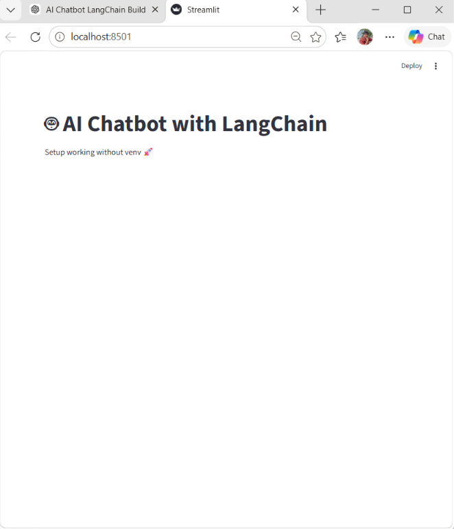
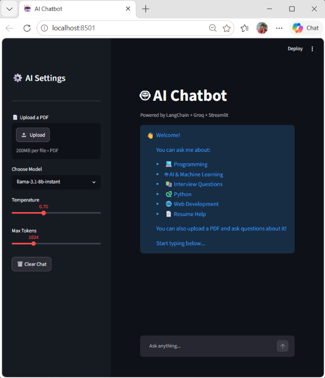

# 🤖 AI Chatbot with RAG (LangChain + Groq + Streamlit)

An intelligent AI chatbot that supports **real-time conversational AI** and **document-based question answering (RAG - Retrieval Augmented Generation)** using **LangChain, Groq LLMs, FAISS vector database, and Streamlit UI**.

---

## 🚀 Live Demo

> (Optional: add later if you deploy on Streamlit Cloud / Render)

---

## 📌 Features

* 💬 Real-time AI chatbot interface
* 📄 Upload PDF and chat with documents (RAG system)
* 🔍 Context-aware answers using vector search
* 🧠 Powered by Groq LLM (fast inference)
* ⚡ Streaming responses for better UX
* 🗂️ Conversation memory support
* 🧩 Modular backend architecture
* 🎨 Clean Streamlit UI with custom styling

---

## 🏗️ System Architecture

```
User Input
   ↓
Streamlit UI (app.py)
   ↓
LangChain Chat Handler
   ↓
┌───────────────────────────────┐
│        RAG Pipeline           │
│                               │
│ PDF Loader                   │
│ Text Splitter                │
│ Embeddings (MiniLM)          │
│ FAISS Vector Store           │
│ Retriever (Top-K chunks)     │
└───────────────────────────────┘
   ↓
Prompt Engineering (Context + Question)
   ↓
Groq LLM (LLaMA 3)
   ↓
AI Response (Streamed Output)
```

---

## 🧠 Tech Stack

* **Frontend:** Streamlit
* **LLM:** Groq (LLaMA 3)
* **Framework:** LangChain
* **Vector DB:** FAISS
* **Embeddings:** HuggingFace (MiniLM)
* **Backend Language:** Python

---

## 📂 Project Structure

```
ai-chatbot-langchain/
│
├── app.py
├── config.py
├── requirements.txt
├── .gitignore
├── .env (not included in repo)
│
├── utils/
│   ├── pdf_loader.py
│   ├── text_splitter.py
│   ├── embeddings.py
│   ├── vector_store.py
│   └── rag.py
│
└── data/ (ignored)
```

---

## ⚙️ Installation & Setup

### 1. Clone the repository

```bash
git clone https://github.com/bharathkumargorre/ai-chatbot-langchain.git
cd ai-chatbot-langchain
```

---

### 2. Create virtual environment

```bash
python -m venv venv
source venv/bin/activate   # Mac/Linux
venv\Scripts\activate      # Windows
```

---

### 3. Install dependencies

```bash
pip install -r requirements.txt
```

---

### 4. Setup environment variables

Create a `.env` file:

```env
GROQ_API_KEY=your_api_key_here
```

---

### 5. Run the application

```bash
streamlit run app.py
```

---

## 📄 How It Works

### 1. Chat Mode

* User sends a message
* Message is passed to Groq LLM
* Response is streamed back in real-time

---

### 2. PDF Chat (RAG Mode)

* User uploads PDF
* Document is split into chunks
* Embeddings are created using MiniLM
* FAISS stores vector embeddings
* User query retrieves relevant chunks
* Context + question sent to LLM
* Final answer generated

---

## 🧪 Example Use Cases

* Ask coding questions
* Upload resumes and get feedback
* Chat with research papers
* Study notes Q&A
* Interview preparation assistant

---

## 📸 Screenshots

### 🏠  App Landing Page


### 💬 ai-chatbot-langchain.png


---

## 🔮 Future Improvements

* 🔗 Add web search integration
* 🧾 Support multiple PDFs
* 💾 Chat history persistence (database)
* 🌐 Deploy on Streamlit Cloud / Render
* 🧠 Add agent-based reasoning

---

## 👨‍💻 Author
G.Bharath Kumar